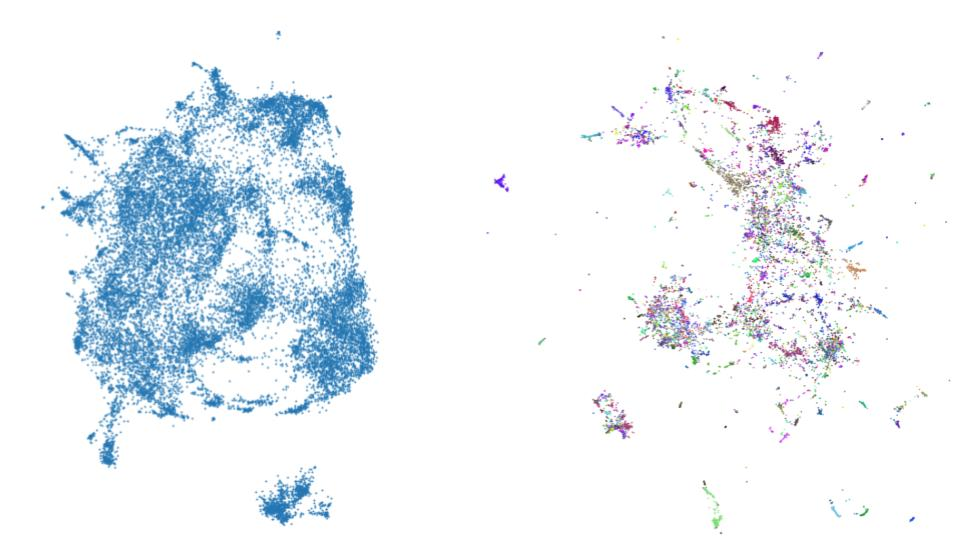
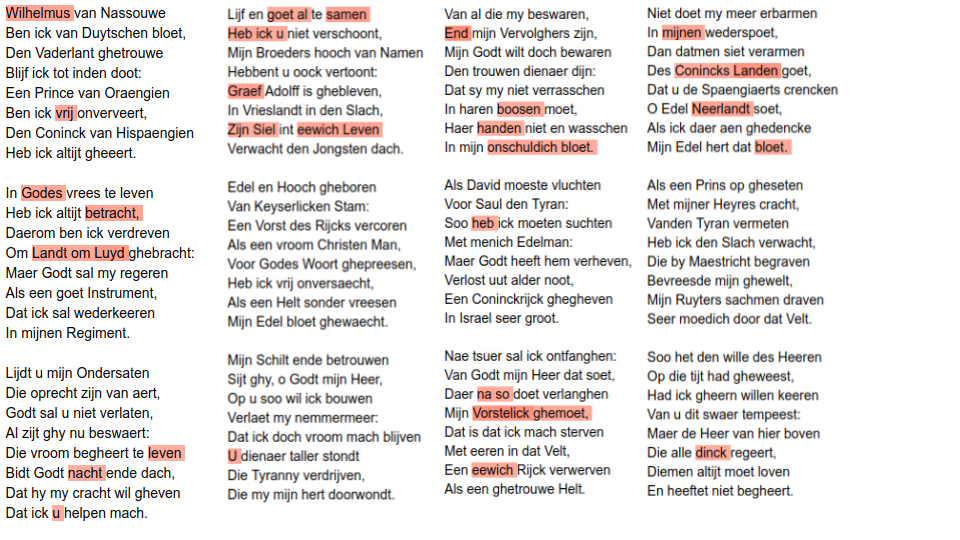

In the run-up to the <a href="https://dh2019.adho.org/">Digital Humanities Conference 2019</a> in Utrecht, a <a href="https://dh2019.adho.org/wilhelmus-challenge/">conference challenge</a> was launched for the first time in DH history. The Challenge was about finding the by now unidentified author of Wilhelmus, known as national anthem of the Netherlands. In order to be able to solve this task, a corpus consisting of 22.000 dutch songs alongside with its authors was provided. The task was to train a classifier on that <a href="https://github.com/fbkarsdorp/meertens-song-collection/releases/tag/DH2019">dataset</a> and predict the authors of a smaller collection of 5000 songs including two versions of Wilhelmus, which came obviosly without authorship information. The idea is that the classifier, which produces the best results on unseen data, is very likely to find the right author of Wilhelmus. To avoid cheating the authors of the testset were only known by the challenge organisators. In this blogpost I will describe my approach and present the model that won in the end.<br>
Before training starts, data must be transformed into the appropriate formats. First I converted the TEI-XML data of the corpus into plain-text and put the authors into a table. From the plain-text I could create a <a href="https://en.wikipedia.org/wiki/Document-term_matrix">document term matrix</a>  for the whole corpus (tokenization was performed with a simple regex). In the next step this matrix gets converted to <a href="https://en.wikipedia.org/wiki/Tf%E2%80%93idf">tf-idf</a> representation.<br>
## Approach 1: Support Vector Machine
To get a feeling for the task I started simple and just handed the tf-idf for the 8000 most frequent words to a support vector machine (SVM). The dataset is quite imbalanced and contains more tahn 250 authors. For this reason I decided not to perfrom a out-of-the-box split in testing and training data (something like 80%/20% split), but to create a testset containing just one song of each author. The result is quite disillusioning with an f1-score of .00021. This is still bad if you take the difficulty of a classification with 250+ classes into account.
## Approach 2: Metric Learning + K-NearestNeighbors
This second approach makes use of the python library <a href="https://umap-learn.readthedocs.io/en/latest/index.html">umap-learn</a>. It is capable of a technique called "supervised dimension reduction". While the general aim of dimesion reduction is to transform data to a 
lower dimensionality without losing too much of information about distances and allow to 
investigate micro and macro structures, its supervised version makes use of labels bound to certain datapoints and weights dimensions in a way that in the lower space representation points with same labels form clusters (if your interested in metric learning, there is a nice and short lecture recording <a href="https://www.youtube.com/watch?v=M0EjrFQH49o">here</a>). You can see the result beneath this paragraph. The left picture shows unsupervised and the right one supervised dimension reduction of the 20.000 songs. Colors indicate authorship. Based on the lower dimension vectors I applied a KNN Classifier, which achieved .12 f1-score. This is still bad, but much better than the SVM.

## Approach 3: Pretrained Word Embeddings + Recurrent Attention Network
The last classification is no longer based on word frequencies, but on pretrained word embedding. In short a word embedding is used to represent a word with a vector.
There are context free embeddings like word2vec, gloVe or fastText and context-sensitive ones like ELMo, GPT or Bert. One big advantage of word embeddings as features
for machine learning is the ability to perform transfer learning. That means information about semantic and syntactic characteristics of language infered by training an embedding
for example on wikipedia articles can be passed to a classifier. With more complex features, the demands on the algorithm that interprets them also increase. For this reason, attempts to combine word embeddings and traditional classification methods often produce weak results. Instead I use a Neural Network for Classification. The architecture of the network is based on the Hierarchical Attention Networks for Document Classification proposed by <a href="https://www.cs.cmu.edu/~./hovy/papers/16HLT-hierarchical-attention-networks.pdf">Yang et al. (2016)</a>. I only use the word encoder and word attention parts of the network, which means that it is no longer hierarchical but rather flat. I will refer to it as Recurrent Attention Network. Here comes the code for building the network:
```python
import keras
import keras.backend as K
from keras import initializers
from keras import regularizers
from keras.layers import Input, Dense, Flatten, LSTM, Concatenate, 
from keras.layers import concatenate,Reshape, multiply, GRU, Permute, 
from keras.layers import merge, Bidirectional, Multiply, Lambda, RepeatVector
from keras.models import Model
from keras.utils import plot_model
from keras.optimizers import Adadelta,Nadam,SGD,Adam
from keras.engine.topology import Layer


class Attention(Layer):
	# Code for the attention layer from https://github.com/minqi/hnatt

        def __init__(self, regularizer=None, **kwargs):
                super(Attention, self).__init__(**kwargs)
                self.regularizer = regularizer
                self.supports_masking = True

        def build(self, input_shape):
                # Create a trainable weight variable for this layer.
                self.context = self.add_weight(name='context', 
                                               shape=(input_shape[-1], 1), 
					       initializer=initializers.RandomNormal(
                                               mean=0.0, stddev=0.05, seed=None),
					       regularizer=self.regularizer,
                                               trainable=True)

                super(Attention, self).build(input_shape)

        def call(self, x, mask=None):
                attention_in = K.exp(K.squeeze(K.dot(x, self.context), axis=-1))
                attention = attention_in/K.expand_dims(K.sum(attention_in, axis=-1), -1)

                if mask is not None:
                        # use only the inputs specified by the mask
                        # import pdb; pdb.set_trace()
                        attention = attention*K.cast(mask, 'float32')

                weighted_sum = K.batch_dot(K.permute_dimensions(x, [0,2,1]), attention)
                return weighted_sum


def declare_model(batch_size, seq_length, emb_size, gru_size):
  ## Input
  sample = Input(batch_shape=(batch_size, seq_length, emb_size, num_classes))
  
  ## Word Encoder
  lstm_out = Bidirectional(GRU(gru_size, 
                               return_sequences=True))(sample)
  ## Hidden Representation 
  dense_transform_w = Dense(seq_length, 
                            activation='relu', 
                            name='dense_transform_w')(lstm_out)
  ## Attention
  attention_weighted_text = Attention(name='sentence_attention')(dense_transform_w)
  ## Prediction
  predictions = Dense(num_classes, activation='softmax')(attention_weighted_text)

  model = Model(inputs=sample, outputs=[predictions])
  model.compile(optimizer=Adam(),
              loss='categorical_crossentropy',
              metrics=[f1])
  print(model.summary())
  return model
```
The first setup takes fastText vectors trained on the dutch wikipedia, batch size 10, seq_length 1000, emb_size 300 and gru_size 128 as input. It is trained for 30 epochs an results in a
f1-score of .72. If you are curios about the process of handing word embeddings to a keras network take a look at this <a href="">blogpost<a/>.
In a second attempt I replaced fastText with the <a href="https://github.com/google-research/bert/blob/master/multilingual.md">multilingual Bert model</a>, but suprisingly the performance droped to .55 f1-score. This contrasts everything
I encountered so far when working with German texts and I think it is caused by imbalanced use of languages in the training process of bert-multilang. But of cause I can't prove it.
To enhence the performance of the fastText embedding a bit, I decided to take the dutch wikipedia model and train it (unsupervised) on the whole song collection. If you want to do it yourself I recommend 
a <a href="https://github.com/ericxsun/fastText">branch</a> of fastText that was never merged to master by ericxsun. This step impoves the result to .78 f1-score. It turned out, that there was no
overfitting and after I handed them my prediciton of the 5000 songs including wilhelmus got the feedback that it achieved .80 accuracy.<br>
As a side product of the Recurrent Attention Network you can visualize the attention scores of words. If you look at those, you have to keep in mind, that attention can be positive e.g. 
relevant because the usage of a word is highly profiling for an author or negative, which means it allows to negate a group of persons as possible authors. I can't say much about it because I can't read Dutch. Nonetheless I want to show it here (red color indicates high attention):

## Final thoughts
I do not intend to proclaim, that fastText is better suited than Bert to solve this task, but I was lacking the resources and the time to train a dutch Bert model and finetune it with the song collection. Despite this I want to highlight the efficiency of domain adoption with pretrained fastText. On the other side I don't want anyone to read this as a document classification benchmark, since I haven't invested into large parametric studies especially in the first and second approach. My model claimed that Frans vander Straten de jongere and Nicolaes Janssens as authors of the two different versions of Wilhelmus. Both are possible, but rather unlikely from the perspective of domain experts. Taking this into account and adding the fact that there were other models with high accuracy scores that applied for the challenge with all together even more implausible candidates my conclusion is, that the real author of Wilhelmus is not present in the dataset. The chance, that I'm wrong and all models failed to uncover the right person is quite low from a statistical point of view.<br>
Thanks for reading.


